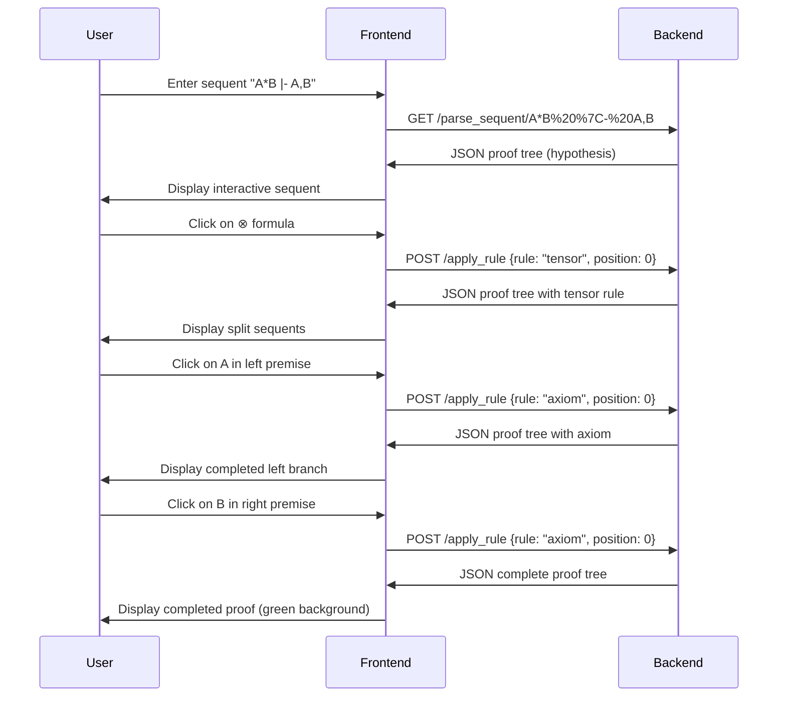

# Click & Collect Architecture Documentation

## Overview

Click & Collect is an interactive web-based Linear Logic theorem prover that allows users to construct proofs by clicking on formulas in a sequent calculus interface. The application consists of an OCaml backend server providing REST API endpoints and a JavaScript frontend for interactive proof construction.

## High-Level Architecture

```
┌─────────────────────────────────────────────────────────────┐
│                    FRONTEND (Browser)                      │
├─────────────────────────────────────────────────────────────┤
│ • HTML/CSS interface (index.html)                          │
│ • JavaScript interaction logic (app.js, proof.js)         │
│ • jQuery UI for drag-and-drop and dialogs                  │
│ • Interactive proof tree visualization                     │
└─────────────────┬───────────────────────────────────────────┘
                  │ HTTP/JSON API calls
                  │ (compressed for bandwidth efficiency)
┌─────────────────▼───────────────────────────────────────────┐
│                    BACKEND (OCaml/Opium)                   │
├─────────────────────────────────────────────────────────────┤
│ • Web server (main.ml) with REST endpoints                 │
│ • Linear Logic parser (ll_lexer.mll, ll_parser.mly)       │
│ • Proof tree data structures (proof.ml)                   │
│ • Rule application logic (apply_rule.ml)                  │
│ • Export functionality (Coq, LaTeX, PDF)                  │
│ • Automated proving (auto_prove_sequent.ml)               │
└─────────────────────────────────────────────────────────────┘
```

## Backend Architecture

### Core Data Structures

The backend is built around several key OCaml modules that define the mathematical foundations:

#### 1. Linear Logic Formulas (`sequent.ml`)

The core data structure represents Linear Logic formulas as an algebraic data type:

```ocaml
type formula =
  | One | Bottom | Top | Zero              (* Constants *)
  | Litt of string | Dual of string        (* Literals and duals *)
  | Tensor of formula * formula             (* A ⊗ B *)
  | Par of formula * formula                (* A ⅋ B *)
  | With of formula * formula               (* A & B *)
  | Plus of formula * formula               (* A ⊕ B *)
  | Ofcourse of formula                     (* !A *)
  | Whynot of formula                       (* ?A *)
```

A **sequent** is represented as `formula list` where formulas before the turnstile (⊢) are implicitly dualized.

#### 2. Proof Trees (`proof.ml`)

Proofs are represented as trees where each node corresponds to an inference rule:

```ocaml
type proof =
  | Axiom_proof of formula                     (* ax: A, A^ *)
  | Tensor_proof of context * proof * proof   (* ⊗: splits context *)
  | Par_proof of context * proof              (* ⅋: combines formulas *)
  | Hypothesis_proof of sequent               (* open goal *)
  (* ... other inference rules ... *)
```

Each proof constructor stores:
- The rule being applied
- The context (surrounding formulas)
- Sub-proofs for the premises

#### 3. Parser (`ll_lexer.mll`, `ll_parser.mly`)

The parser uses ocamllex and ocamlyacc to convert text input into formula structures:

- **Lexer**: Tokenizes Linear Logic syntax (`*`, `|`, `!`, `?`, etc.)
- **Parser**: Builds formula trees with proper operator precedence
- **Error handling**: Provides user-friendly syntax error messages

### Web Server (`main.ml`)

The Opium-based web server provides RESTful endpoints:

#### GET Endpoints (for parsing)
- `/parse_sequent/:sequent` - Parse and validate sequent syntax
- `/parse_formula/:formula` - Parse single formula
- `/is_valid_litt/:literal` - Validate atomic proposition

#### POST Endpoints (for proof construction)
- `/apply_rule` - Apply inference rule to sequent
- `/is_sequent_provable` - Check provability
- `/auto_prove_sequent` - Attempt automated proof
- `/auto_reverse_sequent` - Apply reversible rules

#### POST Endpoints (for export)
- `/export_as_coq` - Generate Coq proof script
- `/export_as_latex/:format/:implicit_exchange` - LaTeX/PDF/PNG export
- `/compress_proof` - Compress proof for URL sharing
- `/uncompress_proof` - Decompress shared proof

### Key Algorithms

#### 1. Rule Application (`apply_rule.ml`)

When a user clicks on a formula in the frontend:

1. **Rule Request**: Frontend sends JSON with:
   - Current sequent
   - Formula position clicked
   - Rule type (inferred from formula structure)

2. **Rule Validation**: Backend checks if rule is applicable:
   - Correct formula type for the rule
   - Valid context for exponential rules
   - Proper permutation for tensor rules

3. **Proof Construction**: Creates new proof tree node with:
   - Applied rule information
   - Generated premise sequents
   - Updated proof structure

#### 2. Automated Proving (`auto_prove_sequent.ml`)

The automated prover uses a focused proof search strategy:

1. **Deterministic Phase**: Apply all reversible rules first
   - Decompose ⅋, &, ⊥, ⊤, ! (when applicable)
   - These rules don't branch the search space

2. **Non-deterministic Phase**: Handle choice points
   - ⊗ rule: try all possible context splits
   - ⊕ rule: try left and right branches
   - Cut rule: try all possible cut formulas

3. **Termination**: Stop on axioms or when search space exhausted

#### 3. Proof Compression (`proof_compression.ml`)

For URL sharing, proofs are compressed using:

1. **JSON Abbreviation**: Shorten common keys
   - `"sequent"` → `"s"`
   - `"appliedRule"` → `"ar"`

2. **LZMA Compression**: Apply standard compression algorithm

3. **Base64 Encoding**: Make URL-safe

## Frontend Architecture

### Core JavaScript Files

#### 1. Application Logic (`app.js`)

Main application controller that handles:

- **Initialization**: Set up event handlers and UI components
- **URL Parameter Processing**: Parse sequent and proof data from URLs
- **Form Handling**: Process sequent input and validation
- **API Communication**: AJAX calls to backend endpoints

#### 2. Proof Visualization (`proof.js`)

Interactive proof tree rendering:

- **Tree Structure**: Build HTML representation of proof trees
- **Click Handlers**: Attach event listeners to formulas for rule application
- **Drag & Drop**: Formula reordering for tensor rule context splitting
- **Export UI**: Buttons for Coq/LaTeX export with option dialogs

#### 3. Sequent Display (`sequent.js`)

Formula rendering and interaction:

- **Symbol Conversion**: Unicode Linear Logic symbols (⊗, ⅋, etc.)
- **Interactive Elements**: Clickable formulas with hover effects
- **Context Highlighting**: Visual feedback for rule applications
- **Notation Support**: Custom user-defined formula abbreviations

### User Interaction Flow

1. **Sequent Input**: User types sequent in input field
2. **Parsing**: AJAX call to `/parse_sequent` endpoint
3. **Tree Display**: Render initial proof tree with open goal
4. **Rule Application**: User clicks formula to apply rule
5. **API Call**: Send rule request to `/apply_rule` endpoint
6. **Tree Update**: Replace clicked node with new rule application
7. **Completion**: When all leaves are axioms, proof is complete

### UI Features

#### Interactive Elements
- **Drag & Drop**: Reorder formulas in sequents
- **Double-Click**: Auto-prove individual sequents
- **Right-Click**: Context menus for advanced options
- **Keyboard**: Arrow keys for navigation

#### Export Options
- **Coq**: Generate formal proof script for verification
- **LaTeX**: Mathematical typesetting for papers
- **PDF/PNG**: Graphical proof images
- **ASCII/UTF-8**: Text-based proof representations

## Data Flow

### Typical Proof Construction Session



### Error Handling

The system distinguishes between:

1. **Syntax Errors**: Invalid sequent syntax
   - Handled by parser with user-friendly messages
   - Examples: unmatched parentheses, invalid operators

2. **Rule Errors**: Invalid rule applications
   - Pedagogical errors: show helpful explanation
   - Examples: trying axiom on non-dual formulas

3. **System Errors**: Server/network issues
   - Technical errors: HTTP error responses
   - Examples: malformed JSON, server unavailable

## Key Design Decisions

### 1. Sequent Representation

**Decision**: Represent sequents as single formula lists instead of separate hypothesis/conclusion lists.

**Rationale**: 
- Simplifies the data structure
- Leverages Linear Logic's symmetry (A ⊢ B ≡ ⊢ A^, B)
- Reduces code complexity in rule applications

### 2. Proof Tree Structure

**Decision**: Store proof trees as algebraic data types with full context information.

**Rationale**:
- Enables proof transformation operations
- Facilitates export to different formats
- Supports undo/redo functionality
- Allows proof sharing via URLs

### 3. Interactive Interface

**Decision**: Click-based rule application rather than explicit rule selection.

**Rationale**:
- Reduces cognitive load for users
- Makes the interface more intuitive
- Automatically infers the correct rule from formula structure
- Follows the design of similar tools like Logitext

### 4. Backend Technology Choice

**Decision**: OCaml with Opium web framework.

**Rationale**:
- Strong type system prevents logic errors
- Pattern matching ideal for tree structures
- Functional programming paradigm fits mathematical domain
- Good performance for symbolic computation

### 5. Frontend Technology Choice

**Decision**: jQuery with vanilla JavaScript instead of modern frameworks.

**Rationale**:
- Simpler deployment and maintenance
- Sufficient for the application's complexity
- Good browser compatibility
- Direct DOM manipulation for interactive proof trees

## Performance Considerations

### Backend Optimization
- **Lazy Evaluation**: Only compute proof branches when needed
- **Memoization**: Cache expensive provability checks
- **Compression**: Reduce JSON payload size for large proofs

### Frontend Optimization
- **Virtual Scrolling**: Handle large proof trees efficiently
- **Event Delegation**: Minimize event handler overhead
- **Debouncing**: Avoid excessive API calls during user interaction

## Security Considerations

- **Input Validation**: All user input is parsed and validated
- **No Code Execution**: The system only manipulates mathematical structures
- **Rate Limiting**: Could be added to prevent API abuse
- **CORS**: Properly configured for web deployment

## Deployment

### Development
```bash
dune build
./_build/default/main.exe
```

### Production
- **Web Server**: nginx proxy to OCaml backend
- **HTTPS**: SSL certificates for secure access
- **Static Files**: Served directly by nginx
- **Monitoring**: Logs for debugging and performance analysis

## Future Extensions

### Planned Features
- **Cut Elimination**: Automated cut-free proof generation
- **Proof Normalization**: Canonical proof forms
- **Advanced Notation**: More flexible user-defined syntax
- **Collaborative Editing**: Multiple users on same proof

### Technical Improvements
- **Performance**: Faster automated proving algorithms
- **UI/UX**: Modern frontend framework migration
- **Mobile**: Touch-friendly interface
- **Accessibility**: Screen reader support

## Conclusion

Click & Collect demonstrates how formal logic tools can be made accessible through intuitive user interfaces. The architecture balances mathematical rigor (enforced by OCaml's type system) with user-friendly interaction patterns. The separation of concerns between backend logic and frontend presentation enables both mathematical correctness and engaging user experience.

The system serves as both an educational tool for learning Linear Logic and a research platform for developing new proof techniques and automated reasoning algorithms.